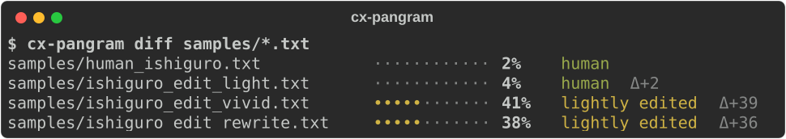

# cx-pangram

Local AI-edit detection with Pangram Labs' [EditLens](https://github.com/pangramlabs/EditLens) models ([Open Pangram](https://huggingface.co/collections/pangram/open-pangram), ICLR 2026).



Install with `uv tool install "cx-pangram @ git+https://github.com/jmpaz/cx-pangram"`.

## Usage

The EditLens models are gated on Hugging Face. Request access through the [Open Pangram collection](https://huggingface.co/collections/pangram/open-pangram), then run `hf auth login` or set `HF_TOKEN`.

Scores run from `0` (human) to `1` (AI-generated), with chunk-level attribution for longer texts.

Longer texts are scored in roughly 350-word chunks; inputs below 50 words are marked unreliable

### CLI

```sh
cx-pangram essay.md                            # any local file (or stdin / --text)
cx-pangram score essay.md --chunks             # per-chunk attribution
cx-pangram diff samples/*.txt                  # side-by-side with deltas
cx-pangram score -q --fail-over 0.5 posts/*.md # gate: exit 3 when over
cx-pangram --json ...                          # json / jsonl / md via -f
cx-pangram eval -n 200 --markdown              # faithfulness vs pangram/editlens_iclr
```

Exit codes: 0 ok · 1 error · 2 usage · 3 gate tripped · 4 gate indeterminate.
Unreliable inputs are excluded from gates.

### Python

```python
from cx_pangram import get_engine

det = get_engine().detect(open("samples/human_ishiguro.txt").read())
print(det.score, det.band, det.confidence, det.chunks)
```

`get_engine()` reuses loaded models. Use `detect_batch` to score multiple documents together.

## Models

| key       | checkpoint                       | selected by default |
| --------- | -------------------------------- | ------------------- |
| `llama`   | `pangram/editlens_Llama-3.2-3B`  | CUDA or MPS         |
| `roberta` | `pangram/editlens_roberta-large` | CPU                 |

Devices are selected in `cuda > mps > cpu` order; use `--device` to override. Install the
`[cuda]` extra for 4-bit Llama on NVIDIA, `[contextualize]` to score external references,
or `[eval]` for the evaluation harness.

